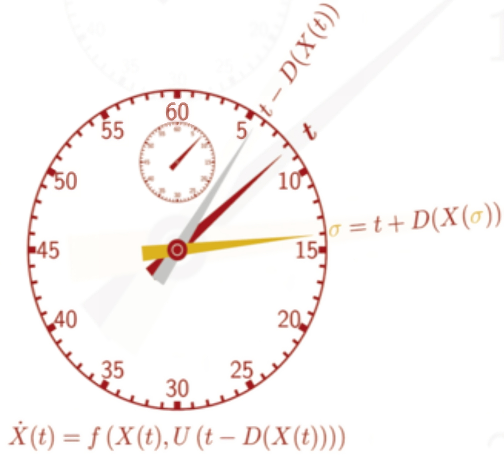
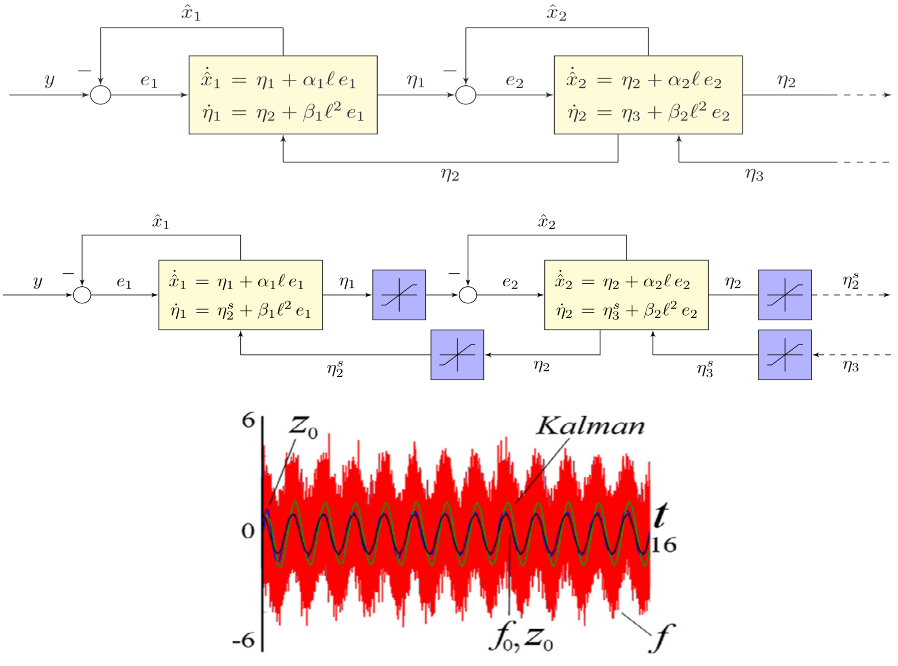
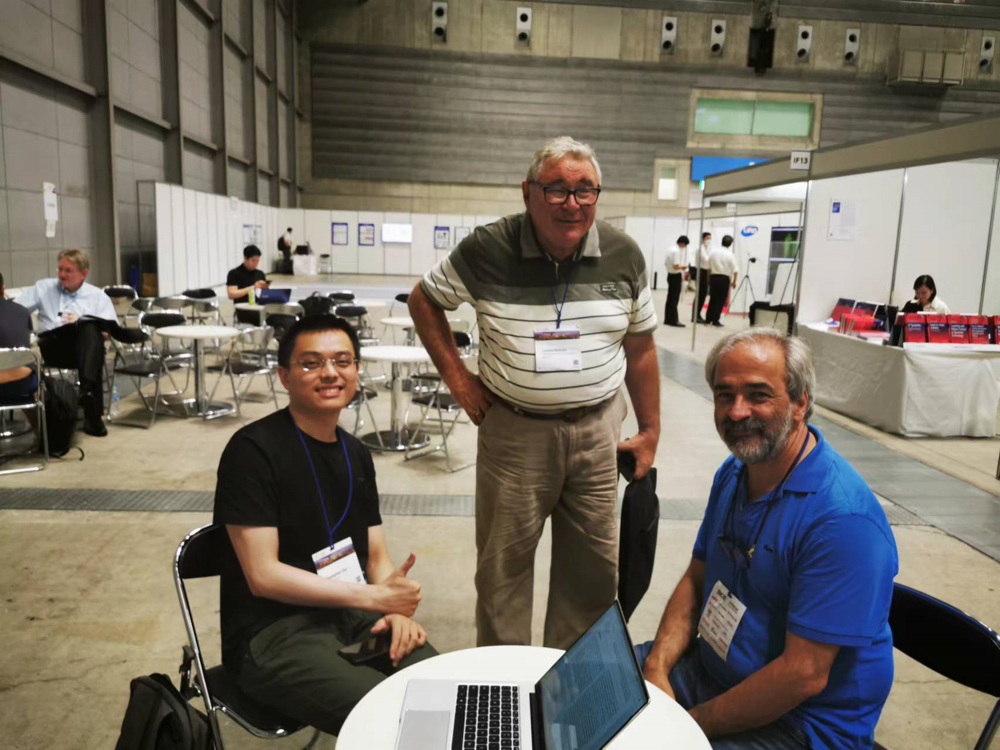
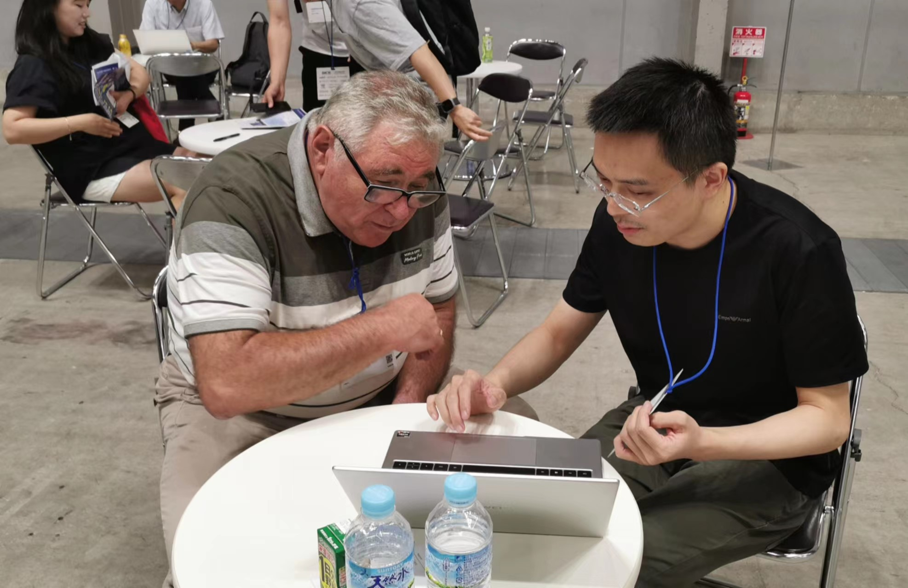

 I am Zhangzhen Zhu, a Ph.D. Candidate at <strong>ZheJiang University</strong>, with the <strong>State Key Laboratory</strong> of Industrial Control Technology. My research interests lie in the areas of <strong>Advanced Robust Motion Control</strong>, and their applications to industrial <strong>complex nonlinear</strong> systems, including but not limited to <strong>ground vehicles</strong>, <strong>UAVs</strong> (experiments over <strong>7+ years</strong>) and brushless DC motors. 
 
 As an experienced Mechatronic systems developer, I have a strong track record in creating complex mechanical, circuit systems from scratch (see my <a href="./markdown" target="_blank" rel="noopener">Projects</a>). Additionally, I am a <strong>master in Matlab/Simulink</strong> and rapid code implementation of new control algorithms from academia into real industrial systems is within my capabilities.

<!--Download my <a href="../files/cv.pdf" target="_blank" rel="noopener">Curriculum Vitae</a> here.-->

       

# 💻 Experience

     

<section id="section-experience" class="home-section wg-experience  ">
 

 

  

  
    

  
  

    
    

      

        

          

            

            

              
 2024.07 - Present 

              
Senior Software Engineer 

            

          

     

# 📖 Educations

     

<section id="section-experience" class="home-section wg-experience  ">
 

   
 

  

  
    

  
  

    
    

      

        

          

            

            

              
 2018.09 - 2024.06 

              
Ph.D. of Control Science and Engineering 

              
<a href="http://www.cse.zju.edu.cn/" target="_blank" rel="noopener">College of Control Science and Engineering, Zhejiang University, Hangzhou</a>

            

          

          

Research interests include:

<ul>
<li>Nonlinear Adaptive High Order Sliding Mode Control / Observer</li>
<li>System Modeling and Identification</li>
<li>Robust Control of Nonlinear Time-Varying Input Delay Systems / Nonlinear Model Predictive Control</li>
<li>Discrete-Time Robust Event-Triggered Control</li>
<li>Realization of other conventional algorithms, like ADRC, H &infin;, MRAC and L1 Adaptive, etc.</li>
</ul>

        

      

    

  

  

   
  
  
  

    
    

      

        

          

            

            

              
 2014.09 - 2018.06 

              
Bachelor of Mechanical and Electrical Engineering

              
<a href="https://changkong.nuaa.edu.cn/" target="_blank" rel="noopener">Chang Kong Honors College, Nanjing University of Aeronautics and Astronautics, Nanjing</a>
 

          

          
          

Research interests include:

<ul>
<li>Control and Design of Unmanned Aerial Vehicles</li>
<li>Embedded system and RTOS development</li>
<li>Design of Complex Mechatronic Systems</li>
</ul>

        

      

    

  
 

  
    

  
  

</section>

       

# 📝 Publications 

    
  
      <strong>Zhangzhen Zhu (Oral)</strong>, 
      Yongliang Lin, 
      Yu Zhang.
  Robust Nonlinear Self-Triggered Control Policy for a Novel Fully Actuated UAVs.
  <strong>Accepted to </strong>22nd IFAC 2023 World Congress.

  
    <a class="btn btn-outline-primary btn-page-header btn-sm" href="../files/IFAC2023_PrePrint.pdf" target="_blank" rel="noopener">PDF </a>
    <a class="btn btn-outline-primary btn-page-header btn-sm" href="https://www.bilibili.com/video/BV1wN411e758/?vd_source=1f43cb54af7af1cff3fc0139054fcab4"     
    target="_blank" rel="noopener"> Video</a>

      <strong>Zhangzhen Zhu </strong>, 
      Yongliang Lin, 
      Yu Zhang.
  Adaptive Quasi-Fixed-Time Integral Terminal Sliding Mode Control for Nonlinear Systems.
  <strong>Accepted to </strong> Transactions on Circuits and Systems II.

  
    <a class="btn btn-outline-primary btn-page-header btn-sm" href="../files/TCAS_II.pdf" target="_blank" rel="noopener">PDF </a>
    <a class="btn btn-outline-primary btn-page-header btn-sm" href="./markdown#TCASII" target="_blank" rel="noopener">Research </a>

    
      <strong>Zhangzhen Zhu </strong>, 
      Jianqiao Yu,  Yongliang Lin,
       Yu Zhang.
  Design, Modeling and Adaptive Robust Control of a Spatial Symmetric Omni-Directional Aerial Vehicle. 
  <strong>Accepted to </strong> IEEE Robotics and Automation Letters.

  
    <a class="btn btn-outline-primary btn-page-header btn-sm" href="./markdown#TIE" target="_blank" rel="noopener"> Research </a>
    <!--
    <a class="btn btn-outline-primary btn-page-header btn-sm" href="https://www.bilibili.com/video/BV1ZW4y1d7Dm/?share_source=copy_web&vd_source=d09cf2aaaac7a6187ef097185616ef97"     
    target="_blank" rel="noopener"> My_Video</a>
    <a class="btn btn-outline-primary btn-page-header btn-sm" href="https://www.bilibili.com/video/BV1Vc411w7wW/?vd_source=1f43cb54af7af1cff3fc0139054fcab4"     
    target="_blank" rel="noopener"> Comaprison_Video</a>
    -->

  
      Yunhe Wang, 
      <strong>Zhangzhen Zhu </strong>, 
      Yu Zhang.
  Modeling and Control of a Novel Over-actuated Tri-rotor UAV.
  <strong>Accepted to </strong>International Conference on Unmanned Aircraft Systems 2020.

  
    <a class="btn btn-outline-primary btn-page-header btn-sm" href="../files/icuas.pdf" target="_blank" rel="noopener">PDF </a>

  
      Jianqiao Yu, 
      <strong>Zhangzhen Zhu </strong>, 
      Junyuan Lu, 
      Sicheng Yin, 
      Yu Zhang.
  Modeling and MPC-based Pose Tracking For Wheeled Bipedal Robot.
  <strong>Accepted to </strong> Robotics and Automation Letters.

  
    <a class="btn btn-outline-primary btn-page-header btn-sm" href="https://www.bilibili.com/video/BV18P411r7Jc/?vd_source=1f43cb54af7af1cff3fc0139054fcab4"     
    target="_blank" rel="noopener"> Video</a>

  
      Yunhe Wang, 
      <strong>Zhangzhen Zhu </strong>, 
      Yu Zhang.
  Backstepping Method and Control Allocation for a Fully-Actuated Tri-Rotor.
  <strong>Accepted to </strong>International Conference on Guidance, Navigation and Control 2020.

    <a class="btn btn-outline-primary btn-page-header btn-sm" href="../files/icgnc.pdf" target="_blank" rel="noopener">PDF </a>

  
      <strong>Zhangzhen Zhu </strong>, 
      Yu Zhang, 
      Ping Li.
  Robust full order sliding mode control for nonlinear systems under time-varying input delay.
  <strong>Under review</strong>, submitted to Transactions on Automatic Control.

  
    <a class="btn btn-outline-primary btn-page-header btn-sm" href="../files/23-0076_01_MS.pdf" target="_blank" rel="noopener">
    PDF </a>

       

  

# 💾 Patent 

<ul class="ul-interests mb-0">
  
    <li>Yicheng Zeng, <strong>Zhangzhen Zhu (director)</strong>, Yu Zhang. <em><strong>CN115806071A</strong></em>.
    

      <a href="../files/CN115806071A.pdf"  target="_blank" rel="noopener">Vector propulsion device and aircraft.</a>  
    

    </li>
  
    <li>Yu Zhang, <strong>Zhangzhen Zhu (director)</strong>, Ping Li. <em><strong>CN108945395</strong></em>. 
    
 
      <a class="btn btn-outline-primary btn-page-header btn-sm" href="../files/certificate.pdf" target="_blank" rel="noopener">PDF </a>
      <a href="../files/CN108945395A.pdf"  target="_blank" rel="noopener">Multi-degree-of-freedom rotor system, rotor system for preventing entanglement, and 
      unmanned aerial vehicle.</a>  
    

    </li>
</ul>

       

# 💻 Research

IFAC 2023

  
    
 <a href="./markdown"  target="_blank" rel="noopener">Robust Nonlinear Self-Triggered Control Policy for a Novel Fully Actuated UAVs</a>  
    <strong>Zhangzhen Zhu</strong>, Yongliang Lin, Yu Zhang 

    

        <strong>RSETC</strong> (robust self event-triggered control) is a computationally efficient and robust control policy for invertible nonlinear
        systems, it ensures robust performance under various perturbations and <strong>alleviating communication
        burden</strong> simultaneously. A novel fully actuated multirotors applied this method shows great
        robustness to perturbations and is able of tracking six dimensional decoupled trajectories
        <strong>without continuous background sensor monitoring</strong>.
    

  

Transactions on Industrial Electronics

    
 <a href="./markdown"  target="_blank" rel="noopener">Adaptive Multivariable Super-Twisting Control for Nonlinear Systems and Its Application to A Novel Fully Actuated UAV</a>  
    <strong>Zhangzhen Zhu</strong>, Yu Zhang, Ping Li

    

        Adaptive Finite-time Multivariable Super-twisting Algorithm (<strong>AFMSTA</strong>) is capable of stabilizing the invertible MIMO nonlinear system in 
        finite-time despite the <strong>co-existence of unknown</strong> model uncertainties and exogenous disturbances. This algorithm guarantees high precision 
        steady state and estimates the bound of the perturbation <strong>online</strong>. An omni-directional control on the novel fully actuated UAV is          accomplished.
    

  

Transactions on Circuits and Systems II

    
 <a href="./markdown"  target="_blank" rel="noopener">Adaptive Quasi-Fixed-Time Integral Terminal Sliding Mode Control for Nonlinear Systems</a>  
    <strong>Zhangzhen Zhu</strong>, Yongliang Lin, Yu Zhang

  
    

         Adaptive quasi-fixed-time integral terminal sliding mode control (<strong>AFTSM</strong>) can stabilize the invertible nonlinear systems with 
         <strong>unknown varying</strong> perturbations in <strong>quasi-fixed-time</strong>, while estimating the lumped perturbations within same time, even 
         with large initial state errors. Besides, a novel <strong>nonsingular adaptive layer function</strong> is introduced, leading to a <strong>completely 
         chattering-free</strong> control with no gain overestimation. The method's superiority is demonstrated through a permanent magnet 
         synchronous motor control experiment.
    

  

Transactions on Automatic Control

    
 <a href="../files/23-0076_01_MS.pdf"  target="_blank" rel="noopener">Robust full order sliding mode control for nonlinear systems under time-varying input 
    delay</a>  
    <strong>Zhangzhen Zhu</strong>, Yongliang Lin, Yu Zhang

  
    

        This paper proposes a <strong>robust predictive
        control</strong> to solve the stabilization problem for nonlinear system with model uncertainties, exogenous disturbances
        and <strong>time-varying input delays</strong>. It’s still an open problem
        to synthesize the sliding mode control with <strong>infinite-dimensional
        backstepping transformation</strong> since the control input
        under SMC is non-differentiable. Hence, our newly designed method is
        presented to solve this open problem.
    

  

Robotics and Automation Letters

    
 <a href="https://www.bilibili.com/video/BV18P411r7Jc/?vd_source=1f43cb54af7af1cff3fc0139054fcab4"  target="_blank" rel="noopener">Modeling and MPC-based Pose Tracking For Wheeled Bipedal Robot</a>  
    Jianqiao Yu, <strong>Zhangzhen Zhu</strong>, Junyuan Lu, Sicheng Yin, Yu Zhang 

  
    

        <strong>Model predictive control</strong> based robot pose controller is proposed for our newly designed wheeled bipedal robot. The robot features
        leg mechanisms with three degrees of freedom, which effectively decouples its rolling and leaning motions. Instead of using a wheeled linear inverted 
        pendulum model, a <strong>floating base model</strong> is introduced to maximize motion flexibility. This hierarchical MPC control can track pose 
        trajectories with lower error than the traditional feedback controllers.
    

  

TAC

    
 <a href="./markdown"  target="_blank" rel="noopener">Adaptive and continuous low-power exact sliding mode observer for arbitrary-order nonlinear systems. 
    </a>  
    To be submitted

    <strong>Zhangzhen Zhu</strong>, Yongliang Lin, Yu Zhang

    

        <strong>ACLEO</strong> Adaptive Continuous Low-power Exact sliding mode observer is a powerful tool for the <strong>output regulation</strong> problems 
        under <strong>measurement noises</strong>. It ensures finite time convergence of the system state under the <strong>unkonwn disturbance</strong>, which 
        only needs the mild assumption that the disturbance's derivative exists. Meanwhile, the disturbance is <strong>exactly estimated</strong> compared with 
        the conventional <strong>High Gain Observers</strong>, and <strong>high-order continuous</strong> control signal is guranteed.
    

  

<table><tr>
<td></td>
<td></td>
</tr></table>

Discuss and analyze the above paper in-depth with academic experts <a href="https://ieeexplore.ieee.org/author/37270305400" target="_blank" rel="noopener">Leonid Fridman</a> and <a href="https://ieeexplore.ieee.org/author/37291091800" target="_blank" rel="noopener">Jaime A. Moreno</a> in Sliding Mode Control, at Yokohama, IFAC 2023.

       

 

# 💻 Internships
- *2016.10 - 2017.06*, NanJing TaoXun Aviation Technology, NanJing.
 

    
 <a href="https://www.bilibili.com/video/BV1Wu4y1U7R7/?vd_source=1f43cb54af7af1cff3fc0139054fcab4"  target="_blank" rel="noopener">Control of coaxial helicopters</a>   

    
 

  

    

