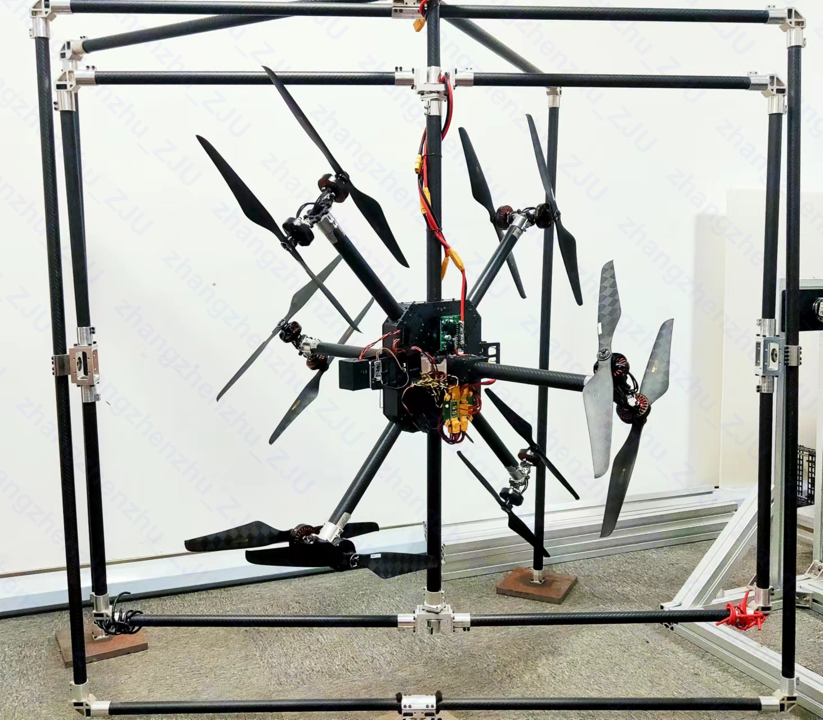
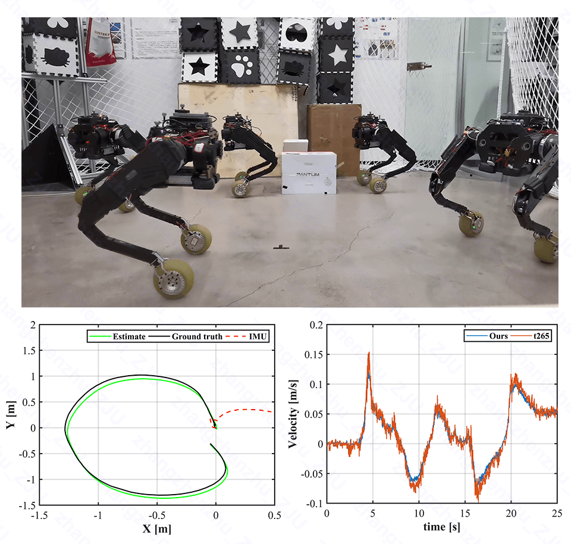
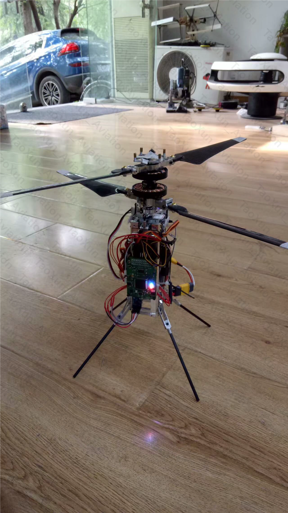

 I am Zhangzhen Zhu (朱张赈), a Ph.D. Candidate at ZheJiang University, with the State Key Laboratory of Industrial Control Technology. My research interests lie in the areas of robust and predictive control, system modeling and identification, and their applications to industrial complex nonlinear systems, including unmanned aerial vehicles (with experiments of over 7+ years) and brushless DC motors. 

 In addition to my academic pursuits, I also possess extensive experience in the development of complex Mechatronic systems from scratch (see my Projects for details), including mechanical system realization, circuit system customization and efficient code deployment. I believe that the familiarity with the hardware systems will effectively enhance control engineers' comprehension of the theoretical research, and to a certain extent, eliminate vacuous mathematical academic research in the control society.
 
 I am dedicated to producing high-quality research and making meaningful contributions to both academics and industrial societies, and making progress together with an excellent team.

       

# 📖 Educations

     

<section id="section-experience" class="home-section wg-experience  ">
 

   
 

  

  
    

  
  

    
    

      

        

          

            

            

              
 2018.09 - Present 

              
Ph.D. candidate of Control Science and Engineering 

              
<a href="http://www.cse.zju.edu.cn/" target="_blank" rel="noopener">College of Control Science and Engineering, Zhejiang University, Hangzhou</a>

            

          

          

Research interests include:

<ul>
<li>Nonlinear Adaptive High Order Sliding Mode Control / Observer</li>
<li>Time-Varying Input Delay Systems / Nonlinear Model Predictive Control</li>
<li>Discrete-Time Robust Event-Triggered Control</li>
</ul>

        

      

    

  

  

   
  
  
  

    
    

      

        

          

            

            

              
 2014.09 - 2018.06 

              
Bachelor of Mechanical and Electrical Engineering

              
<a href="https://changkong.nuaa.edu.cn/" target="_blank" rel="noopener">Chang Kong Honors College, Nanjing University of Aeronautics and Astronautics, Nanjing</a>
 

          

          
          

Research interests include:

<ul>
<li>Control and Design of Unmanned Aerial Vehicles</li>
<li>Design of Complex Mechatronic Systems</li>
</ul>

        

      

    

  
 

  
    

  
  

</section>

       

# 📝 Publications 

  <!--  -->
    
  
      <strong>Zhangzhen Zhu (Oral)</strong>, 
      Yongliang Lin, 
      Yu Zhang.
  Robust Nonlinear Self-Triggered Control Policy for a Novel Fully Actuated UAVs.
  <em><strong>Accepted to </strong></em>22nd IFAC 2023 World Congress.

  
    <a class="btn btn-outline-primary btn-page-header btn-sm" href="../files/IFAC2023_PrePrint.pdf" target="_blank" rel="noopener">PDF </a>
    <a class="btn btn-outline-primary btn-page-header btn-sm" href="https://www.bilibili.com/video/BV1wN411e758/?vd_source=1f43cb54af7af1cff3fc0139054fcab4"     
    target="_blank" rel="noopener"> Video</a>

  
      <strong>Zhangzhen Zhu </strong>, 
      Yongliang Lin, 
      Yu Zhang.
  Adaptive Quasi-Fixed-Time Integral Terminal Sliding Mode Control for Nonlinear Systems.
  <em><strong>Under review (second round)</strong></em>, submitted to Transactions on Circuits and Systems II.

  
    <a class="btn btn-outline-primary btn-page-header btn-sm" href="./markdown#TCASII" target="_blank" rel="noopener">Research </a>

  
      <strong>Zhangzhen Zhu </strong>, 
      Yu Zhang, 
      Ping Li.
  Adaptive Multivariable Super-Twisting Control for Nonlinear Systems and Its Application to A Novel Fully Actuated UAV. 
  <em><strong>Under review</strong></em>, submitted to Transactions on Industrial Electronics.

  
    <a class="btn btn-outline-primary btn-page-header btn-sm" href="./markdown#TIE" target="_blank" rel="noopener"> Research </a>
    <a class="btn btn-outline-primary btn-page-header btn-sm" href="https://www.bilibili.com/video/BV1ZW4y1d7Dm/?share_source=copy_web&vd_source=d09cf2aaaac7a6187ef097185616ef97"     
    target="_blank" rel="noopener"> Video</a>

  
      <strong>Zhangzhen Zhu </strong>, 
      Yu Zhang, 
      Ping Li.
  Robust full order sliding mode control for nonlinear systems under time-varying input delay.
  <em><strong>Under review</strong></em>, submitted to Transactions on Automatic Control.

  
    <a class="btn btn-outline-primary btn-page-header btn-sm" href="../files/IFAC2023_PrePrint.pdf" target="_blank" rel="noopener">
    Research </a>

  
      Yunhe Wang, 
      <strong>Zhangzhen Zhu </strong>, 
      Yu Zhang.
  Modeling and Control of a Novel Over-actuated Tri-rotor UAV.
  <em><strong>Accepted to </strong></em>International Conference on Unmanned Aircraft Systems 2020.

  
    <a class="btn btn-outline-primary btn-page-header btn-sm" href="../files/icuas.pdf" target="_blank" rel="noopener">PDF </a>

  
      Yunhe Wang, 
      <strong>Zhangzhen Zhu </strong>, 
      Yu Zhang.
  Backstepping Method and Control Allocation for a Fully-Actuated Tri-Rotor.
  <em><strong>Accepted to </strong></em>International Conference on Guidance, Navigation and Control 2020.

  
    <a class="btn btn-outline-primary btn-page-header btn-sm" href="../files/icgnc.pdf" target="_blank" rel="noopener">PDF </a>

  
      Jianqiao Yu, 
      <strong>Zhangzhen Zhu </strong>, 
      Junyuan Lu, 
      Sicheng Yin, 
      Yu Zhang.
  Modeling and MPC-based Pose Tracking For Wheeled Bipedal Robot.
  <em><strong>Under review (second round)</strong></em>, submitted to Robotics and Automation Letters.

  
    <a class="btn btn-outline-primary btn-page-header btn-sm" href="https://www.bilibili.com/video/BV1wN411e758/?vd_source=1f43cb54af7af1cff3fc0139054fcab4"     
    target="_blank" rel="noopener"> Video</a>

  

       

  

# 💾 Patent 

<ul class="ul-interests mb-0">
  
    <li>Yu Zhang, <strong>Zhangzhen Zhu (director)</strong>, Ping Li.  Multi-degree-of-freedom rotor system, rotor system for preventing entanglement, and unmanned aerial vehicle. <em> 
    <strong>CN108945395</strong></em>.</li>
          
    <li>Yicheng Zeng, <strong>Zhangzhen Zhu (director)</strong>, Yu Zhang.  Vector propulsion device and aircraft. <em> 
    <strong>CN115806071A</strong></em>.</li> 
</ul>

       

  
# 💻 Projects

IFAC 2023

  
    
 <a href="./markdown"  target="_blank" rel="noopener">Robust Nonlinear Self-Triggered Control Policy for a Novel Fully Actuated UAVs</a>  
    <strong>Zhangzhen Zhu</strong>, Yongliang Lin, Yu Zhang 

    

        <strong>RSETC</strong> (robust self event-triggered control) is a computationally efficient and robust control policy for invertible nonlinear
        systems, it ensures robust performance under various perturbations and alleviating communication
        burden simultaneously. A novel fully actuated multirotors applied this method shows great
        robustness to perturbations and is able of tracking six dimensional decoupled trajectories
        without continuous background sensor monitoring.
    

  

Transactions on Industrial Electronics

    
 <a href="./markdown"  target="_blank" rel="noopener">Adaptive Multivariable Super-Twisting Control for Nonlinear Systems and Its Application to A Novel Fully Actuated UAV</a>  
    <strong>Zhangzhen Zhu</strong>, Yu Zhang, Ping Li

    

        <strong>RSETC</strong> (robust self event-triggered control) is a computationally efficient and robust control policy for invertible nonlinear
        systems, it ensures robust performance under various perturbations and alleviating communication
        burden simultaneously. A novel fully actuated multirotors applied this method shows great
        robustness to perturbations and is able of tracking six dimensional decoupled trajectories
        without continuous background sensor monitoring.
    

  

Transactions on Circuits and Systems II

    
 <a href="./markdown"  target="_blank" rel="noopener">Adaptive Quasi-Fixed-Time Integral Terminal Sliding Mode Control for Nonlinear Systems</a>  
    <strong>Zhangzhen Zhu</strong>, Yongliang Lin, Yu Zhang

  
    

        <strong>RSETC</strong> (robust self event-triggered control) is a computationally efficient and robust control policy for invertible nonlinear
        systems, it ensures robust performance under various perturbations and alleviating communication
        burden simultaneously. A novel fully actuated multirotors applied this method shows great
        robustness to perturbations and is able of tracking six dimensional decoupled trajectories
        without continuous background sensor monitoring.
    

  

Transactions on Automatic Control

    
 <a href="./markdown"  target="_blank" rel="noopener">Robust full order sliding mode control for nonlinear systems under time-varying input delay</a>  
    <strong>Zhangzhen Zhu</strong>, Yongliang Lin, Yu Zhang

  
    

        <strong>RSETC</strong> (robust self event-triggered control) is a computationally efficient and robust control policy for invertible nonlinear
        systems, it ensures robust performance under various perturbations and alleviating communication
        burden simultaneously. A novel fully actuated multirotors applied this method shows great
        robustness to perturbations and is able of tracking six dimensional decoupled trajectories
        without continuous background sensor monitoring.
    

  

Transactions on Automatic Control

    
 <a href="./markdown"  target="_blank" rel="noopener">Adaptive low-power exact sliding mode observer for arbitrary-order nonlinear systems </a>  
    <strong>Zhangzhen Zhu</strong>, Yu Zhang, Ping Li

  
    

        <strong>RSETC</strong> (robust self event-triggered control) is a computationally efficient and robust control policy for invertible nonlinear
        systems, it ensures robust performance under various perturbations and alleviating communication
        burden simultaneously. A novel fully actuated multirotors applied this method shows great
        robustness to perturbations and is able of tracking six dimensional decoupled trajectories
        without continuous background sensor monitoring.
    

  

Robotics and Automation Letters

    
 <a href="./markdown"  target="_blank" rel="noopener">Modeling and MPC-based Pose Tracking For Wheeled Bipedal Robot</a>  
    Jianqiao Yu, <strong>Zhangzhen Zhu</strong>, Junyuan Lu, Sicheng Yin, Yu Zhang 

  
    

        <strong>RSETC</strong> (robust self event-triggered control) is a computationally efficient and robust control policy for invertible nonlinear
        systems, it ensures robust performance under various perturbations and alleviating communication
        burden simultaneously. A novel fully actuated multirotors applied this method shows great
        robustness to perturbations and is able of tracking six dimensional decoupled trajectories
        without continuous background sensor monitoring.
    

  

       

 

# 💻 Internships
- *2016.10 - 2017.06*, NanJing TaoXun Aviation Technology, NanJing.
- 

    
 <a href="https://www.bilibili.com/video/BV1Wu4y1U7R7/?vd_source=1f43cb54af7af1cff3fc0139054fcab4"  target="_blank" rel="noopener">Control of coaxial helicopters</a>   

    
 

  

    

