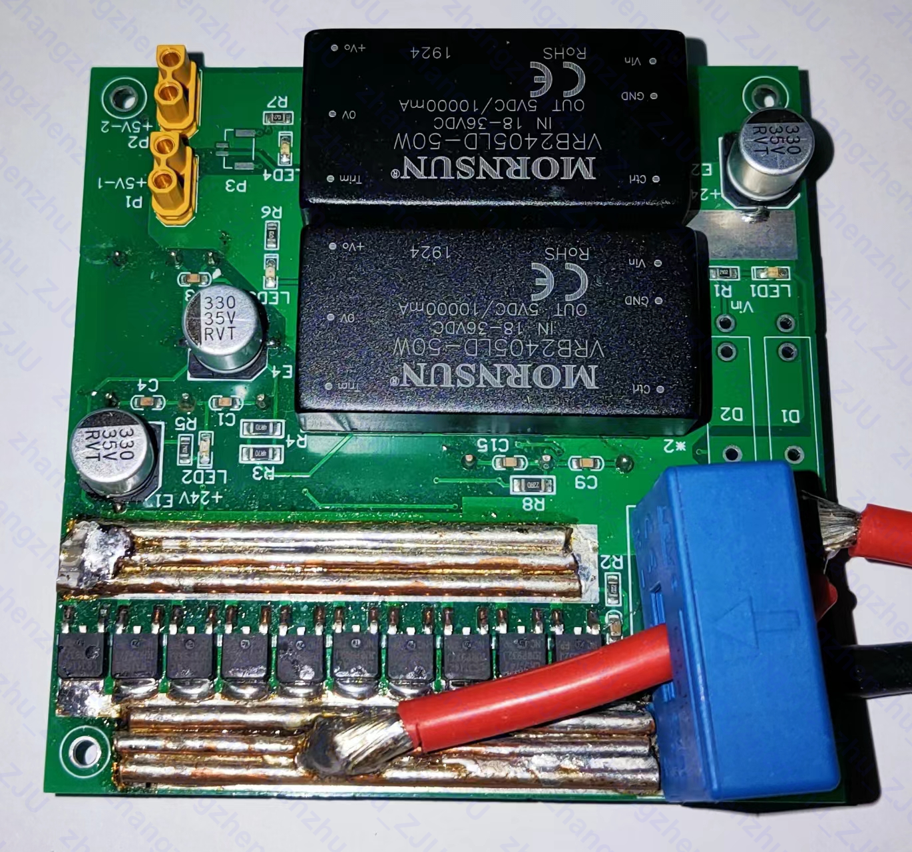
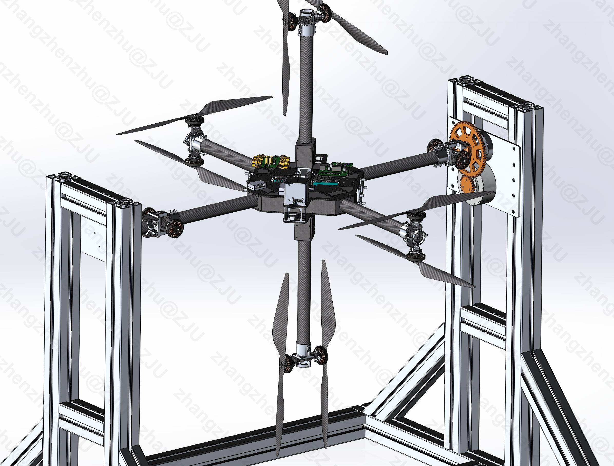

💻 IFAC 2023 World Congress

IFAC 2023

  
    <!-- <a name="TCAS">here is the redirected page</a> -->
  
    
 <a href="../files/IFAC2023_PrePrint.pdf" target="_blank" rel="noopener">Robust Nonlinear Self-Triggered Control Policy for a Novel Fully Actuated UAVs.</a>  
    <strong>Zhangzhen Zhu</strong>, Yongliang Lin, Yu Zhang. 

    

        <strong>RSETC</strong> (robust self event-triggered control) is a computationally efficient and robust control policy for invertible nonlinear
        systems, it ensures robust performance under various perturbations and <strong>alleviating communication
        burden</strong> simultaneously. A novel fully actuated multirotors applied this method shows great
        robustness to perturbations and is able of tracking six dimensional decoupled trajectories
        <strong>without continuous background sensor monitoring</strong>.
    

  

<table><tr>
<td></td>
<td></td>
</tr></table>

<table><tr>
<td></td>
<td></td>
</tr></table>

<table><tr>
<td></td>
<td></td>
</tr></table>

<table><tr>
<td></td>
<td></td>
</tr></table>

    

💻 Some Mechatronic System Works
<table><tr>
<td></td>
<td></td>
</tr></table>

<table><tr>
<td></td> 
<td></td>
</tr></table>

<table><tr>
<td></td>
<td></td>
</tr></table>

<table><tr>
<td></td>
<td></td>
</tr></table>

<table><tr>
<td></td>
<td></td>
</tr></table>

    

💻 Transactions on Industrial Electronics

Transactions on Industrial Electronics

    
    
 Adaptive Multivariable Super-Twisting Control for Nonlinear Systems and Its Application to A Novel Fully Actuated UAV.  
    <strong>Zhangzhen Zhu</strong>, Yu Zhang, Ping Li. 

    

        Adaptive Finite-time Multivariable Super-twisting Algorithm (<strong>AFMSTA</strong>) is capable of stabilizing the invertible MIMO nonlinear system in 
        finite-time despite the <strong>co-existence of unknown</strong> model uncertainties and exogenous disturbances. This algorithm guarantees high precision 
        steady state and estimates the bound of the perturbation <strong>online</strong>. An omni-directional control on the novel fully actuated UAV is          accomplished.
    

  

<table><tr>
<td></td> 
<td></td>
</tr></table>

<table><tr>
<td></td>
<td></td> 
</tr></table>

<table><tr>
<td></td>
<td></td>
</tr></table>

System Identification is conducted to obtain the transfer function from the actuator to UAV's angular speed. The <strong>swept-frequency chirp signal</strong> is utilized and a second order transfer function, including the <strong>actuator's time constant</strong> and the <strong>inertia tensor</strong> are obtained. Hence, the acturator dynamics is <strong>compensated</strong> to obtain a fast dynamic response.

<table><tr>
<td></td>
<td></td>
</tr></table>

<table><tr>
<td></td>
<td></td>
</tr></table>

<strong>Nonlinear</strong> dynamics on the <strong>entire SE3 manifold</strong> is modeled and newly designed multivariable sliding surface is utilized. Rigorous finite-time stability is analyzed.
  
    <a class="btn btn-outline-primary btn-page-header btn-sm" href="https://www.bilibili.com/video/BV1ZW4y1d7Dm/? 
    share_source=copy_web&vd_source=d09cf2aaaac7a6187ef097185616ef97"     
    target="_blank" rel="noopener"> My_Video</a>
    <a class="btn btn-outline-primary btn-page-header btn-sm" href="https://www.bilibili.com/video/BV1Vc411w7wW/?vd_source=1f43cb54af7af1cff3fc0139054fcab4"     
    target="_blank" rel="noopener"> Comaprison_Video</a>

   

💻 Transactions on Circuits and Systems II

TCAS II

    
    
 Adaptive Quasi-Fixed-Time Integral Terminal Sliding Mode Control for Nonlinear Systems.  
    <strong>Zhangzhen Zhu</strong>, Yongliang Lin, Yu Zhang. 

    

         Adaptive quasi-fixed-time integral terminal sliding mode control (<strong>AFTSM</strong>) can stabilize the invertible nonlinear systems with 
         <strong>unknown varying</strong> perturbations in <strong>quasi-fixed-time</strong>, while estimating the lumped perturbations within same time, even 
         with large initial state errors. Besides, a novel <strong>nonsingular adaptive layer function</strong> is introduced, leading to a <strong>completely 
         chattering-free</strong> control with no gain overestimation. The method's superiority is demonstrated through a permanent magnet 
         synchronous motor control experiment.
    

  

<table><tr>
<td></td>
<td></td>
</tr></table>

For example, imposing an input disturbance d(t) = sin(5t) + cos(4t) on the nonlinear system with integral of chains (2nd order). As depicted, all the states with <strong> different initial values</strong> converge in fixed-time and the disturbance is estimated <strong> online adaptively</strong>.

   

💻 Transactions on Automatic Control

TAC

    
    
 Adaptive and continuous low-power exact sliding mode observer for arbitrary-order nonlinear systems.  
    To be submitted

    

        <strong>ACLEO</strong> Adaptive Continuous Low-power Exact sliding mode observer is a powerful tool for the <strong>output regulation</strong> problems 
        under <strong>measurement noises</strong>. It ensures finite time convergence of the system state under the <strong>unkonwn disturbance</strong>, which 
        only needs the mild assumption that the disturbance's derivative exists. Meanwhile, the disturbance is <strong>exactly estimated</strong> compared with 
        the conventional <strong>High Gain Observers</strong>, and <strong>high-order continuous</strong> control signal is guranteed.
    

  

<table><tr>
<td></td>
<td></td>
</tr></table>

Inspired by the Low-power high gain observer, our new algorithm has some advantages:

<ul>
<li>Insensitivity to measurement noises</li>
<li>Robust to unknown perturbations</li>
<li>Continuous control signal</li>
<li>Exact disturbance estimation with no phase lag</li>
<li>Online tuning of the observer gain</li>
</ul>

We implement this new algorithm on the above newly designed fully actuated UAV, where <strong>only</strong> attitude and position feedback information can be obtained (e.g., from <strong>Motion Capture System</strong>). The nominal mass of the drone m_n(t) = 6kg, and the actual varying total mass m(t) = 6 + 1.5 sin(5t) + cos(2t);

<table><tr>
<td></td>
<td></td>
</tr></table>

    

        As depicted above, the varying unkonw load mass m_l(t) = 1.5 sin(5t) + cos(2t) is exactly estimated <strong>without phase lag</strong>, and the control 
        input signal is tolerated for real systems compared with the conventional Levant's Observer.
        This new observer based control algorithm will bring significant values in industrial applications such as motor control, chassis control and etc.
    

  

       

