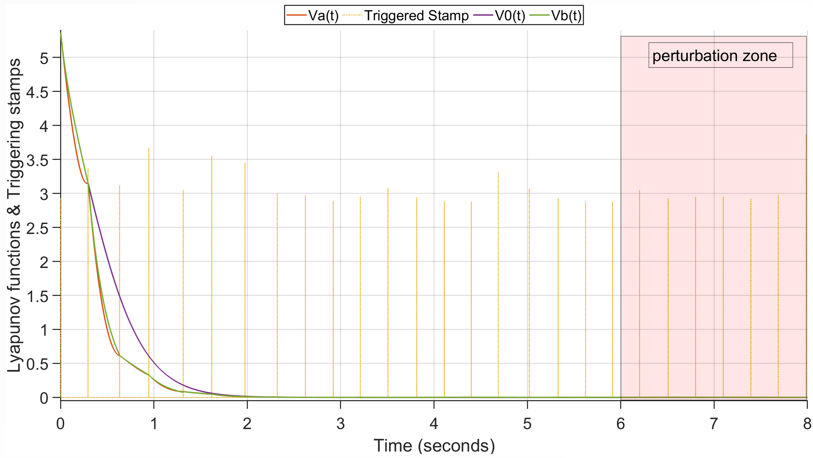
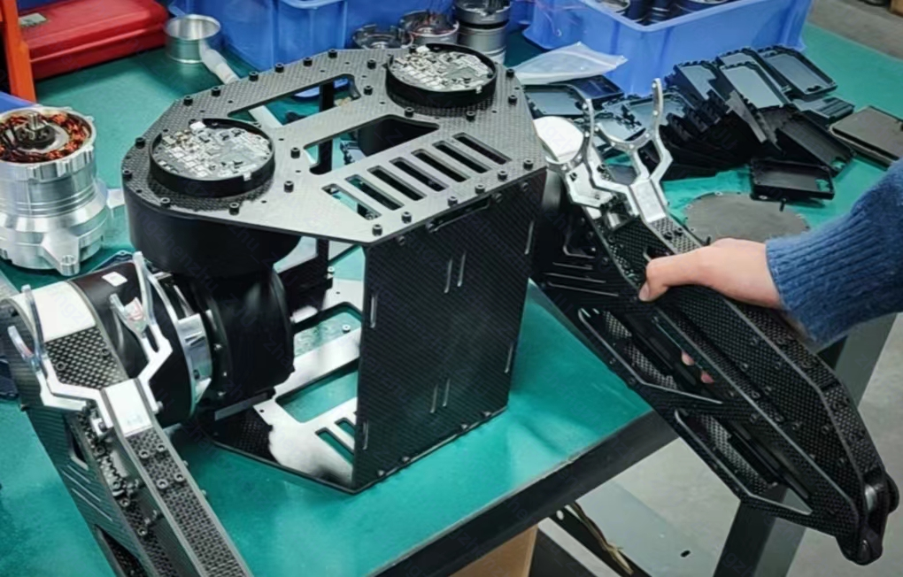

💻 IFAC 2023 World Congress

IFAC 2023

  
    <!-- <a name="TCAS">here is the redirected page</a> -->
  
    
 <a href="../files/IFAC2023_PrePrint.pdf" target="_blank" rel="noopener">Robust Nonlinear Self-Triggered Control Policy for a Novel Fully Actuated UAVs</a>  
    <strong>Zhangzhen Zhu</strong>, Yongliang Lin, Yu Zhang 

    

        <strong>RSETC</strong> (robust self event-triggered control) is a computationally efficient and robust control policy for invertible nonlinear
        systems, it ensures robust performance under various perturbations and alleviating communication
        burden simultaneously. A novel fully actuated multirotors applied this method shows great
        robustness to perturbations and is able of tracking six dimensional decoupled trajectories
        without continuous background sensor monitoring.
    

  

<table><tr>
<td></td>
<td></td>
</tr></table>

<table><tr>
<td></td>
<td></td>
</tr></table>

<table><tr>
<td></td>
<td></td>
</tr></table>

<table><tr>
<td></td>
<td></td>
</tr></table>

    

💻 Some Mechatronic Systems Works
<table><tr>
<td></td>
<td></td>
</tr></table>

<table><tr>
<td></td> 
<td></td>
</tr></table>

<table><tr>
<td></td>
<td></td>
</tr></table>

<table><tr>
<td></td>
<td></td>
</tr></table>

<table><tr>
<td></td>
<td></td>
</tr></table>

    

💻 Transactions on Industrial Electronics

IFAC 2023

    
    
 <a href="../files/IFAC2023_PrePrint.pdf" target="_blank" rel="noopener">Robust Nonlinear Self-Triggered Control Policy for a Novel Fully Actuated UAVs</a>  
    <strong>Zhangzhen Zhu</strong>, Yongliang Lin, Yu Zhang 

    

        <strong>RSETC</strong> (robust self event-triggered control) is a computationally efficient and robust control policy for invertible nonlinear
        systems, it ensures robust performance under various perturbations and alleviating communication
        burden simultaneously. A novel fully actuated multirotors applied this method shows great
        robustness to perturbations and is able of tracking six dimensional decoupled trajectories
        without continuous background sensor monitoring.
    

  

💻 Transactions on Circuits and Systems II

IFAC 2023

    
    
 <a href="../files/IFAC2023_PrePrint.pdf" target="_blank" rel="noopener">Robust Nonlinear Self-Triggered Control Policy for a Novel Fully Actuated UAVs</a>  
    <strong>Zhangzhen Zhu</strong>, Yongliang Lin, Yu Zhang 

    

        <strong>RSETC</strong> (robust self event-triggered control) is a computationally efficient and robust control policy for invertible nonlinear
        systems, it ensures robust performance under various perturbations and alleviating communication
        burden simultaneously. A novel fully actuated multirotors applied this method shows great
        robustness to perturbations and is able of tracking six dimensional decoupled trajectories
        without continuous background sensor monitoring.
    

  

💻 Robotics and Automation Letters

IFAC 2023

  
    <!-- <a name="TIE">here is the redirected page</a> -->
  
    
 <a href="../files/IFAC2023_PrePrint.pdf" target="_blank" rel="noopener">Robust Nonlinear Self-Triggered Control Policy for a Novel Fully Actuated UAVs</a>  
    <strong>Zhangzhen Zhu</strong>, Yongliang Lin, Yu Zhang 

    

        <strong>RSETC</strong> (robust self event-triggered control) is a computationally efficient and robust control policy for invertible nonlinear
        systems, it ensures robust performance under various perturbations and alleviating communication
        burden simultaneously. A novel fully actuated multirotors applied this method shows great
        robustness to perturbations and is able of tracking six dimensional decoupled trajectories
        without continuous background sensor monitoring.
    

  

       

## Locations of key files/directories

* Basic config options: _config.yml
* Top navigation bar config: _data/navigation.yml
* Single pages: _pages/
* Collections of pages are .md or .html files in:
  * _publications/
  * _portfolio/
  * _posts/
  * _teaching/
  * _talks/
* Footer: _includes/footer.html
* Static files (like PDFs): /files/
* Profile image (can set in _config.yml): images/profile.png
